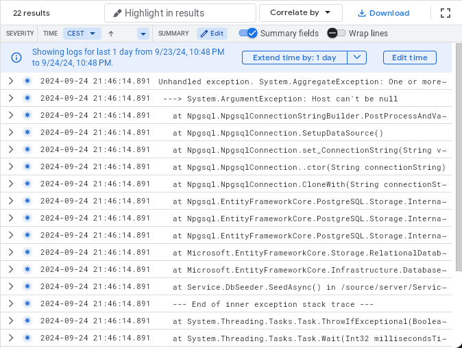
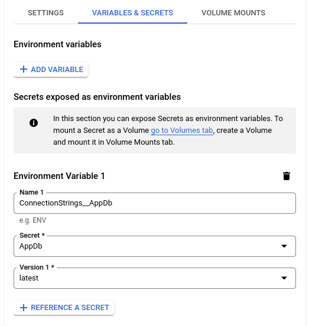
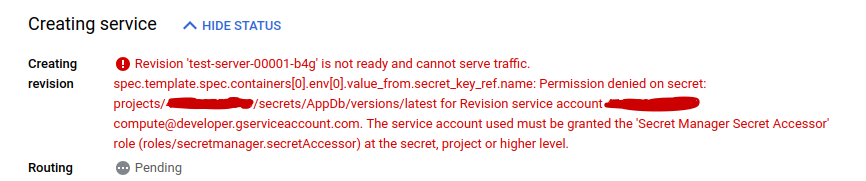
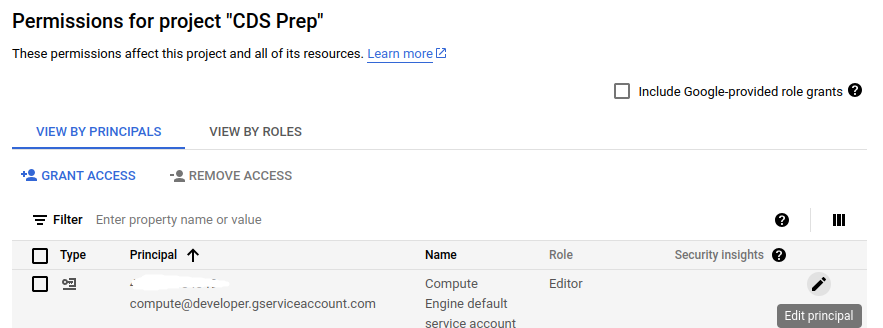
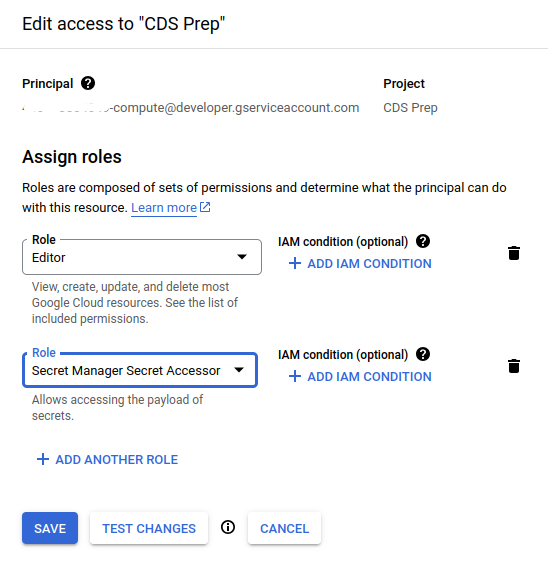

# Quick Deployment on Google Cloud

## Back-end

Create or select a Google Cloud project.

[**Go to project selector**](https://console.cloud.google.com/projectselector2/home/dashboard)

- Install [Google Cloud CLI](https://cloud.google.com/sdk/docs/install) if you don't already have it.
- Install [Firebase CLI](https://firebase.google.com/docs/cli/#install_the_firebase_cli) if you don't have it already.
  - I recommend installing it with `npm install -g firebase-tools`

In a terminal:

```sh
gcloud init
```

Follow the instructions to login, if you aren't already logged in.
Make sure you select the project you want to use when prompted.

Then enable the required Cloud Run Admin API:

```
gcloud services enable run.googleapis.com
```

Open your project in Rider.
Change the following line at the bottom of your `Program.cs` file:

```sh
app.Run();
```

To:

```cs
var port = Environment.GetEnvironmentVariable("PORT") ?? "8080";
var url = $"http://0.0.0.0:{port}";
app.Run(url);
```

Replace `8080` with whatever port your back-end project normally runs on.

```sh
gcloud run deploy
```

It should give you an error like this:

```
ERROR: (gcloud.run.deploy) Revision 'gcloud-demo-00001-h48' is not ready and cannot serve traffic. The user-pr
ovided container failed to start and listen on the port defined provided by the PORT=8080 environment variable. Logs for this
revision might contain more information.
```

Fear not.
You likely just need to configure a secret for the connection string.

You can confirm this by opening the log link.
If you see lines containing `Npgsql.NpgsqlConnection` in the error output it
means it is the connection string.



Okay.
Let's fix it.

[Go to Secret Manager](https://console.cloud.google.com/security/secret-manager)

Create a new secret with your connection string.

If your connection string starts with `postgres://` or `jdbc:postgresql://`,
then you need to convert it to .NET format using my [Connection-string
Converter](https://rpede.github.io/connection_strings/).

Next you need to update your failed deployment.

[**Go to Cloud Run**](https://console.cloud.google.com/run?referrer=search&project=deploy-tutorial-436615)

- Click on the failed deployment.
- Then click "EDIT & DEPLOY NEW REVISION".
- Under "VARIABLES & SECRETS", click "+ REFERENCE A SECRET".
- For name, type name of the environment variable you use for connection-string
  in your back-end.
- Select the secret you just created with the connection-string.
- Select "latest" in "Version" field.
- Click the "DEPLOY" button.

Here is an example:



_Note: Adjust the names to what you have_

If you still get a permission error like this:



[**Go to IAM**](https://console.cloud.google.com/iam-admin/iam)

Find the account with the name from the error and click "Edit principal".



Then add the "Secret Manager Secret Accessor" role and "Save".



Deploy a new revision as before.

🤞 your back-end should start.

## Front-end

Adjust your `baseUrl` to point to the back-end on Google Cloud.
It is likely found in `http.ts`.

Open a terminal in the root of your project or use the one in Rider.

```
npm clean-install --prefix client
npm run build --prefix client
firebase init hosting
```

Answer as shown:

```
? Please select an option: Add Firebase to an existing Google Cloud Platform project
? Select the Google Cloud Platform project you would like to add Firebase: (Choose your project here)
? What do you want to use as your public directory? client/dist
? Configure as a single-page app (rewrite all urls to /index.html)? Yes
? Set up automatic builds and deploys with GitHub? No
? File client/dist/index.html already exists. Overwrite? No
```

Then deploy with:

```sh
firebase deploy --only hosting
```

## Redeploy

To redeploy the same project, you don't have to do much.
Just open a terminal in the project root or use the one in Rider.

```sh
gcloud run deploy
firebase deploy --only hosting
```

## Resources

- [Quickstart: Deploy a .NET service to Cloud Run](https://cloud.google.com/run/docs/quickstarts/build-and-deploy/deploy-dotnet-service)
- [Get started with Firebase Hosting](https://firebase.google.com/docs/hosting/quickstart)
